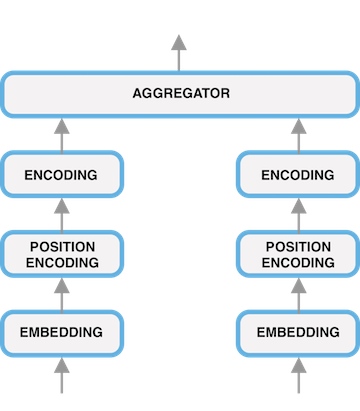
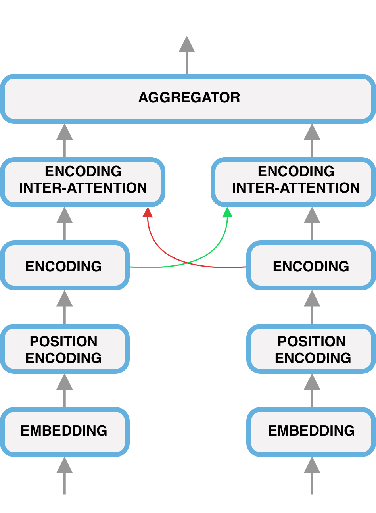

# Natural Language Inference Test Bed
This is a testbed for comparing various deep learning models in the context of Natural Language Inference (NLI) implemented in [PyTorch](http://pytorch.org).

Since there is no standard architecture for NLI, we have integrated all the models into two main architectures, a siamese architecture and a matching-aggregate architecture.

Note that this repo is not optimized for speed.

<!-- .element height="50%" width="50%" -->
<!-- .element height="50%" width="50%" -->

# Requirement

# Usage

    pip install -r requirements.txt
    python -m spacy download en
    python run.py [MODE] [MODEL]

MODE: train, test, visualize 
MODEL: TRANSFORMER_INTER_ATTENTION, TRANSFORMER, LSTM

When changing dataset, change the vector cache file

# Acknowledgment
- https://github.com/harvardnlp/annotated-transformer
- https://github.com/pytorch/examples/tree/master/snli
- https://github.com/galsang/BIMPM-pytorch
- https://github.com/huggingface/pytorch-openai-transformer-lm