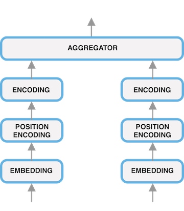
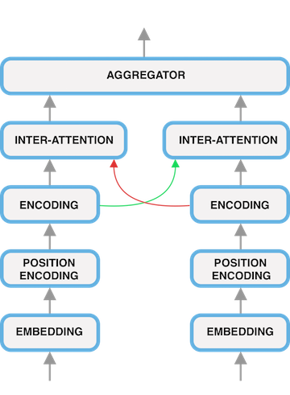

# Natural Language Inference Test Bed
This is a testbed for comparing various deep learning models in the context of Natural Language Inference (NLI) implemented in [PyTorch](http://pytorch.org).

Two archietctures used in this code:

# Requirement

# Usage

First create a virtualenv and install the requirements:

    pip install -r requirements.txt
    python -m spacy download en

Then you can run the model:

    python run.py [MODE] [CONFIG_FILE]

`MODE` is one of the `train`, `test`, or `interactive`. `CONFIG_FILE` is the path to the config file.

## Test
Example:

    python run.py test configs/rnn_attn.json

make sure `restore_model` is set to true and a valid model is provided in `restore_path`.

## Interactive
Example:

    python run.py interactive configs/rnn_attn.json

make sure `restore_model` is set to true and a valid model is provided in `restore_path`.

# Acknowledgment
- https://github.com/harvardnlp/annotated-transformer
- https://github.com/pytorch/examples/tree/master/snli
- https://github.com/galsang/BIMPM-pytorch
- https://github.com/huggingface/pytorch-openai-transformer-lm