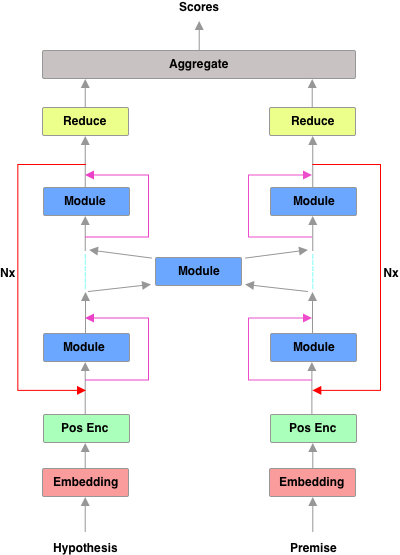

# Natural Language Inference Test Bed
---------------------
This is a testbed for comparing various deep learning models in the context of Natural Language Inference (NLI) implemented in [PyTorch](http://pytorch.org).

Below is the general architecture used:



# Usage
---------------------
First create a virtualenv and install the requirements:

    pip install -r requirements.txt
    python -m spacy download en

Then you can run the model:

    python run.py [MODE] [CONFIG_FILE]

`MODE` is one of the `train`, `test`, or `interactive`. `CONFIG_FILE` is the path to the config file.

We use Tensorboard to visualize the all the curves:
    tensorboard --logdir [RUN_PATH]

## Test
---------------------
Example:

    python run.py test configs/rnn_attn.json

make sure `restore_model` is set to true and a valid model is provided in `restore_path`.

## Interactive
---------------------
Example:

    python run.py interactive configs/rnn_attn.json

make sure `restore_model` is set to true and a valid model is provided in `restore_path`.


## Design a model
---------------------
Models are designed in `ARCHITECTURE` section of the config file. Below are its main components:

`name`: name of the model. Results are saved with this name.

`nx`: the number of times `layers` in `structure` are repeated. Note that for each repitition new parameters are created so they don't share parameters across iterations.

`layers`: layers are defined in here.

`structure`: a list containing the order of the layers.

`reducer`: reducers are any kind of models that reduce the sequence length to a fixed length so that they can be fed into the aggregation layer.

`aggregator`: this model gets the encoded premise and encoded hypothesis and gives the final classification scores.

### Define a layer
---------------------
There is a `vector` dictionary which is passed into any layer/module and contains all the arrays up to that point. Therefor all the inputs for a specific layer are taken from this dictionary and then the outputs of that layer are used to update the dictionary.

Each layer can have any number of inputs and any number of outputs. We define these inputs and outputs when we are defining a layer.
A layer is defined as following:
```
"layer_2": {
    "name":"attention_vanilla",
    "inputs": ["h_rnn", "p_rnn"],
    "outputs": [
        {
            "name":"h",
            "res_connection_add": ["h_rnn"],
            "res_connection_concat": []
        }
    ],
    "config": {
        "hidden_size": 100,
        "save_path": "results"
    }
}
```

`name`: name of the module which is defined in the `__init__.py` of `layers` package

`inputs`: list containing the inputs for this module. Note that order of the inputs are important as they will be fed in with the same order.

`outputs`: list containing the outputs of each module. Each output is defined as a dictionary. `name` is the name that will be used as the key in `vectors` to update the output. `res_connection_add` is a list of array names from `vectors` that will be added to this output. `res_connection_concat` is a list of array names from `vectors` which will be concatenated to the output. Note the the addition is done before concatanation.

`config`: dictionary containing configuration required for that specific module.


There are two types of layers: 
One type has two seperate sections for premise `p` and hypothesis `h` which are for the cases that you want to define two seperate models premise and hypothesis, or same model with different configs. An example:

```
"layer_2": {
    "name":"attention_vanilla",
    "inputs": ["h_rnn", "p_rnn"],
    "outputs": [
        {
            "name":"h",
            "res_connection_add": ["h_rnn"],
            "res_connection_concat": []
        }
    ],
    "config": {
        "hidden_size": 100,
        "save_path": "results"
    }
}
```

The other type is for the cases that you model takes both `p` and `h` or probably another input from previous layers and it outputs both `p` and `h` or probably some other outputs. Hence, in this type there is no seperate sections for `h` and `p`.

```
"layer_2": {
    "h":{
        "name":"attention_vanilla",
        "inputs": ["h_rnn", "p_rnn"],
        "outputs": [
            {
                "name":"h",
                "res_connection_add": ["h_rnn"],
                "res_connection_concat": []
            }
        ],
        "config": {
            "hidden_size": 100,
            "save_path": "results"
        }
    },
    "p":{
        "name":"attention_vanilla",
        "inputs": ["p_rnn", "h_rnn"],
        "outputs": [
            {
                "name":"p",
                "res_connection_add": ["p_rnn"],
                "res_connection_concat": []
            }
        ],
        "config": {
            "hidden_size": 100,
            "save_path": "results"
        }
    }
}
```

## Results
---------------------
Performed on NVIDIA k80 GPU.

Model/Config | Max Dev Acc | Test Acc At Max Dev 
------------ | ------------ | -------------
transformer.json | 76.23% | 75.45%
rnn.json | 73.72% | 73.32%
rnn_siamese.json | 81.26% | 80.55%
bimpm.json* | 83.41% | 83.33%

* BIMPM does not have the character encoding and some configs are different.

# Acknowledgment
---------------------
- https://github.com/harvardnlp/annotated-transformer
- https://github.com/pytorch/examples/tree/master/snli
- https://github.com/galsang/BIMPM-pytorch
- https://github.com/huggingface/pytorch-openai-transformer-lm
- https://github.com/libowen2121/SNLI-decomposable-attention